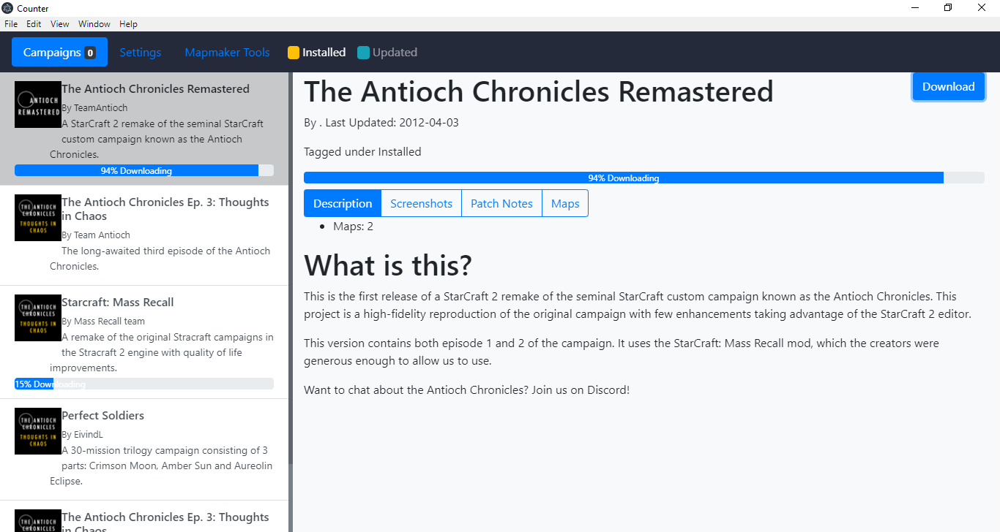

# sc2-campaign-manager

A Campaign Manager for StarCraft II. Since the game doesnt natively support custom campaigns, and a regular user has to go through hoops to get one running, this tool aims to simplify that process, providing a simple "marketplace" where to download and run custom campaigns.

# Where to Download

You can always find the latest release below:

:link: **[Download](https://github.com/abrahamYG/sc2-campaign-manager/releases/latest)**

# Contribute

## How to run

* `npm install`: Install all required dependencies

* `npm run dev`: Creates the Renderer
* `npm run electron`: Creates the Electron Instance
* `npm start`: Creates both the renderer and the electron instance.

## Building for Production

`npm run build`

Uses [electron-react-boilerplate-minimal](https://github.com/f-prime/electron-react-boilerplate-minimal) as a boilerplate.
